# AXYRA — Conceptual ERD

**Versión:** 1.0
**Estado:** Draft / Baseline
**Fecha:** 2026-10-06
**Proyecto:** AXYRA
**Documento:** Conceptual Entity-Relationship Diagram

---

# 1. Propósito

Este documento define el modelo entidad-relación conceptual de AXYRA.

Su objetivo es representar las principales entidades identificadas en el Domain Model y establecer sus relaciones, cardinalidades y límites de pertenencia.

Este documento no representa todavía el esquema físico de PostgreSQL.

No se definen en esta etapa:

* Tipos SQL definitivos.
* Índices físicos.
* Constraints específicos del motor.
* Políticas RLS.
* Triggers.
* Funciones almacenadas.
* Migraciones.
* Detalles de implementación de Supabase.

Estos elementos serán definidos durante el Database Design.

---

# 2. Principios

El modelo ERD sigue estos principios:

1. Todo dato operativo debe pertenecer a un Tenant.
2. Las relaciones deben representar reglas reales del negocio.
3. Las entidades comerciales deben conservar información histórica relevante.
4. Los productos y sus precios deben estar desacoplados.
5. El inventario debe ser trazable mediante movimientos.
6. Las entidades de configuración deben permitir personalización por Tenant.
7. Las relaciones muchos-a-muchos deben utilizar entidades asociativas.
8. El modelo debe permitir evolución futura sin acoplar AXYRA a una industria específica.

---

# 3. Arquitectura conceptual

```text
                         ┌──────────────┐
                         │    TENANT    │
                         └──────┬───────┘
                                │
        ┌───────────────┬───────┼────────┬───────────────┐
        │               │       │        │               │
        ▼               ▼       ▼        ▼               ▼
      USERS         PRODUCTS CUSTOMERS ORDERS          SERVICES
        │               │       │        │               │
        ▼               │       │        ▼               ▼
      ROLES             │       │    ORDER_ITEMS   SERVICE_REQUESTS
        │               │       │
        ▼               │       └───────┐
   PERMISSIONS          │               │
                        ▼               ▼
                  PRICE_LISTS       QUOTES
                        │               │
                        ▼               ▼
                 PRICE_LIST_ITEMS  QUOTE_ITEMS
                        │
                        ▼
                   INVENTORY
                        │
                        ▼
                INVENTORY_MOVEMENTS
```

---

# 4. Tenant Boundary

`Tenant` constituye el límite principal de aislamiento de datos.

```text
Tenant
 │
 ├── Users
 ├── Products
 ├── Categories
 ├── Price Lists
 ├── Inventory
 ├── Customers
 ├── Orders
 ├── Quotes
 ├── Services
 ├── Settings
 └── Audit Logs
```

Un Tenant nunca debe acceder a entidades pertenecientes a otro Tenant.

---

# 5. Entidades principales

## 5.1 Tenant

```text
Tenant
-------------------------
id
name
legal_name
tax_identifier
slug
status
created_at
updated_at
```

### Relaciones

```text
Tenant 1 ──── N User
Tenant 1 ──── N Product
Tenant 1 ──── N Category
Tenant 1 ──── N PriceList
Tenant 1 ──── N Customer
Tenant 1 ──── N Order
Tenant 1 ──── N Quote
Tenant 1 ──── N ServiceType
Tenant 1 ──── N ServiceRequest
Tenant 1 ──── N AuditLog
```

---

# 6. Identity & Access

## 6.1 User

```text
User
-------------------------
id
tenant_id
name
email
phone
status
created_at
updated_at
```

Relación:

```text
Tenant 1 ──── N User
```

---

## 6.2 Role

```text
Role
-------------------------
id
tenant_id
name
description
```

Relación:

```text
Tenant 1 ──── N Role
```

---

## 6.3 Permission

```text
Permission
-------------------------
id
name
description
```

Las permissions representan capacidades disponibles en la plataforma.

No pertenecen obligatoriamente a un Tenant, ya que pueden formar parte del catálogo global de permisos de AXYRA.

---

## 6.4 UserRole

Entidad asociativa:

```text
UserRole
-------------------------
user_id
role_id
```

Relación:

```text
User N ──── N Role
```

---

## 6.5 RolePermission

Entidad asociativa:

```text
RolePermission
-------------------------
role_id
permission_id
```

Relación:

```text
Role N ──── N Permission
```

---

# 7. Catalog

## 7.1 Product

```text
Product
-------------------------
id
tenant_id
name
description
sku
barcode
brand
unit
status
created_at
updated_at
```

Relaciones:

```text
Tenant 1 ──── N Product
Product N ──── N Category
Product 1 ──── N ProductImage
Product 1 ──── N PriceListItem
Product 1 ──── 1 Inventory
Product 1 ──── N InventoryMovement
```

---

# 8. Category

```text
Category
-------------------------
id
tenant_id
name
description
status
created_at
updated_at
```

Relación:

```text
Category N ──── N Product
```

La relación se implementa mediante `ProductCategory`.

---

# 9. ProductCategory

```text
ProductCategory
-------------------------
product_id
category_id
```

Representa la relación:

```text
Product N ──── N Category
```

---

# 10. ProductImage

```text
ProductImage
-------------------------
id
product_id
url
alt_text
position
is_primary
```

Relación:

```text
Product 1 ──── N ProductImage
```

---

# 11. Price Lists

## 11.1 PriceList

```text
PriceList
-------------------------
id
tenant_id
name
description
currency
is_default
is_public
status
```

Relación:

```text
Tenant 1 ──── N PriceList
```

---

## 11.2 PriceListItem

```text
PriceListItem
-------------------------
id
price_list_id
product_id
price
minimum_quantity
created_at
updated_at
```

Relaciones:

```text
PriceList 1 ──── N PriceListItem
Product 1 ──── N PriceListItem
```

Esto permite:

```text
Product
   │
   ├── Retail Price
   ├── Wholesale Price
   ├── Distributor Price
   └── Special Price
```

sin agregar columnas específicas al producto.

---

# 12. Inventory

## 12.1 Inventory

```text
Inventory
-------------------------
id
tenant_id
product_id
quantity
minimum_quantity
reserved_quantity
updated_at
```

Relaciones:

```text
Tenant 1 ──── N Inventory
Product 1 ──── 1 Inventory
```

En el MVP se contempla un inventario principal por producto.

El soporte para múltiples almacenes podrá incorporarse posteriormente.

---

# 13. InventoryMovement

```text
InventoryMovement
-------------------------
id
tenant_id
product_id
type
quantity
reason
reference_type
reference_id
performed_by
created_at
```

Relaciones:

```text
Product 1 ──── N InventoryMovement
User 1 ──── N InventoryMovement
Tenant 1 ──── N InventoryMovement
```

Ejemplo:

```text
Product
   │
   ├── Movement: IN +50
   ├── Movement: OUT -10
   ├── Movement: OUT -5
   └── Movement: ADJUSTMENT_IN +2
```

---

# 14. Customers

## 14.1 Customer

```text
Customer
-------------------------
id
tenant_id
name
email
phone
document_type
document_number
customer_type
status
created_at
updated_at
```

Relaciones:

```text
Tenant 1 ──── N Customer
Customer 1 ──── N CustomerAddress
Customer 1 ──── N Order
Customer 1 ──── N Quote
Customer 1 ──── N ServiceRequest
```

---

# 15. CustomerAddress

```text
CustomerAddress
-------------------------
id
customer_id
label
address
city
department
postal_code
is_primary
```

Relación:

```text
Customer 1 ──── N CustomerAddress
```

---

# 16. Commerce

## 16.1 Cart

```text
Cart
-------------------------
id
tenant_id
customer_id
session_identifier
status
created_at
updated_at
```

Relaciones:

```text
Tenant 1 ──── N Cart
Customer 1 ──── N Cart
Cart 1 ──── N CartItem
```

`customer_id` puede ser nulo porque el MVP permite compras sin cuenta.

---

# 17. CartItem

```text
CartItem
-------------------------
id
cart_id
product_id
quantity
unit_price
```

Relaciones:

```text
Cart 1 ──── N CartItem
Product 1 ──── N CartItem
```

---

# 18. Orders

## 18.1 Order

```text
Order
-------------------------
id
tenant_id
customer_id
order_number
status
price_list_id
subtotal
discount
tax
total
notes
created_at
updated_at
```

Relaciones:

```text
Tenant 1 ──── N Order
Customer 1 ──── N Order
PriceList 1 ──── N Order
Order 1 ──── N OrderItem
```

---

# 19. OrderItem

```text
OrderItem
-------------------------
id
order_id
product_id
product_name_snapshot
sku_snapshot
quantity
unit_price
discount
tax
subtotal
total
```

Relaciones:

```text
Order 1 ──── N OrderItem
Product 1 ──── N OrderItem
```

Los snapshots permiten conservar el estado comercial utilizado cuando se creó la orden.

---

# 20. Quotes

## 20.1 Quote

```text
Quote
-------------------------
id
tenant_id
customer_id
quote_number
status
price_list_id
subtotal
discount
tax
total
valid_until
notes
created_at
updated_at
```

Relaciones:

```text
Tenant 1 ──── N Quote
Customer 1 ──── N Quote
PriceList 1 ──── N Quote
Quote 1 ──── N QuoteItem
```

---

# 21. QuoteItem

```text
QuoteItem
-------------------------
id
quote_id
product_id
product_name_snapshot
sku_snapshot
quantity
unit_price
discount
tax
subtotal
total
```

Relaciones:

```text
Quote 1 ──── N QuoteItem
Product 1 ──── N QuoteItem
```

---

# 22. Quote → Order

La relación entre cotización y orden debe permitir la conversión comercial:

```text
Quote
  │
  │ ACCEPTED
  ▼
Order
```

La implementación física puede utilizar una referencia como:

```text
Order.source_quote_id
```

o una relación equivalente.

La decisión final pertenece al Database Design.

---

# 23. Services

## 23.1 ServiceType

```text
ServiceType
-------------------------
id
tenant_id
name
description
base_price
duration_estimate
status
```

Relaciones:

```text
Tenant 1 ──── N ServiceType
ServiceType 1 ──── N ServiceRequest
```

---

# 24. ServiceRequest

```text
ServiceRequest
-------------------------
id
tenant_id
customer_id
service_type_id
status
description
scheduled_at
address
created_at
updated_at
```

Relaciones:

```text
Tenant 1 ──── N ServiceRequest
Customer 1 ──── N ServiceRequest
ServiceType 1 ──── N ServiceRequest
ServiceRequest 1 ──── N ServiceAssignment
ServiceRequest 1 ──── N ServiceNote
```

---

# 25. ServiceAssignment

```text
ServiceAssignment
-------------------------
id
service_request_id
user_id
assigned_at
completed_at
status
```

Relaciones:

```text
ServiceRequest 1 ──── N ServiceAssignment
User 1 ──── N ServiceAssignment
```

---

# 26. ServiceNote

```text
ServiceNote
-------------------------
id
service_request_id
author_id
content
created_at
```

Relaciones:

```text
ServiceRequest 1 ──── N ServiceNote
User 1 ──── N ServiceNote
```

---

# 27. Configuration

## 27.1 TenantSettings

```text
TenantSettings
-------------------------
id
tenant_id
business_name
logo_url
currency
whatsapp_number
default_price_list_id
inventory_policy
```

Relación:

```text
Tenant 1 ──── 1 TenantSettings
```

---

# 28. BusinessHours

```text
BusinessHours
-------------------------
id
tenant_id
day_of_week
opening_time
closing_time
is_open
```

Relación:

```text
Tenant 1 ──── N BusinessHours
```

---

# 29. ModuleConfiguration

```text
ModuleConfiguration
-------------------------
id
tenant_id
module
enabled
configuration
```

Relación:

```text
Tenant 1 ──── N ModuleConfiguration
```

Ejemplos:

```text
CATALOG
INVENTORY
ORDERS
QUOTES
SERVICES
ANALYTICS
WHATSAPP
```

---

# 30. Audit

## 30.1 AuditLog

```text
AuditLog
-------------------------
id
tenant_id
user_id
action
entity_type
entity_id
previous_value
new_value
ip_address
created_at
```

Relaciones:

```text
Tenant 1 ──── N AuditLog
User 1 ──── N AuditLog
```

---

# 31. Modelo ERD completo

```mermaid
erDiagram

    TENANT ||--o{ USER : owns
    TENANT ||--o{ ROLE : defines
    TENANT ||--o{ PRODUCT : owns
    TENANT ||--o{ CATEGORY : owns
    TENANT ||--o{ PRICE_LIST : defines
    TENANT ||--o{ INVENTORY : owns
    TENANT ||--o{ INVENTORY_MOVEMENT : records
    TENANT ||--o{ CUSTOMER : has
    TENANT ||--o{ CART : owns
    TENANT ||--o{ ORDER : receives
    TENANT ||--o{ QUOTE : creates
    TENANT ||--o{ SERVICE_TYPE : offers
    TENANT ||--o{ SERVICE_REQUEST : receives
    TENANT ||--o{ MODULE_CONFIGURATION : configures
    TENANT ||--o{ BUSINESS_HOURS : defines
    TENANT ||--o{ AUDIT_LOG : records
    TENANT ||--|| TENANT_SETTINGS : configures

    USER }o--o{ ROLE : assigned
    ROLE }o--o{ PERMISSION : grants

    PRODUCT }o--o{ CATEGORY : classified
    PRODUCT ||--o{ PRODUCT_IMAGE : has
    PRODUCT ||--o{ PRICE_LIST_ITEM : priced
    PRICE_LIST ||--o{ PRICE_LIST_ITEM : contains

    PRODUCT ||--|| INVENTORY : stocked
    PRODUCT ||--o{ INVENTORY_MOVEMENT : generates
    USER ||--o{ INVENTORY_MOVEMENT : performs

    CUSTOMER ||--o{ CUSTOMER_ADDRESS : has
    CUSTOMER ||--o{ CART : owns
    CUSTOMER ||--o{ ORDER : places
    CUSTOMER ||--o{ QUOTE : requests
    CUSTOMER ||--o{ SERVICE_REQUEST : requests

    CART ||--o{ CART_ITEM : contains
    PRODUCT ||--o{ CART_ITEM : references

    ORDER ||--|{ ORDER_ITEM : contains
    PRODUCT ||--o{ ORDER_ITEM : references
    PRICE_LIST ||--o{ ORDER : used_by

    QUOTE ||--|{ QUOTE_ITEM : contains
    PRODUCT ||--o{ QUOTE_ITEM : references
    PRICE_LIST ||--o{ QUOTE : used_by

    SERVICE_TYPE ||--o{ SERVICE_REQUEST : defines
    SERVICE_REQUEST ||--o{ SERVICE_ASSIGNMENT : has
    SERVICE_REQUEST ||--o{ SERVICE_NOTE : contains
    USER ||--o{ SERVICE_ASSIGNMENT : performs
    USER ||--o{ SERVICE_NOTE : writes

    USER ||--o{ AUDIT_LOG : creates
```



---

# 32. Cardinality Summary

| Relación                     | Cardinalidad |
| ---------------------------- | -----------: |
| Tenant → User                |          1:N |
| Tenant → Product             |          1:N |
| Tenant → Category            |          1:N |
| Tenant → Customer            |          1:N |
| Tenant → Order               |          1:N |
| Tenant → Quote               |          1:N |
| Tenant → ServiceRequest      |          1:N |
| Tenant → PriceList           |          1:N |
| User ↔ Role                  |          N:M |
| Role ↔ Permission            |          N:M |
| Product ↔ Category           |          N:M |
| Product → ProductImage       |          1:N |
| Product → PriceListItem      |          1:N |
| PriceList → PriceListItem    |          1:N |
| Product → Inventory          |          1:1 |
| Product → InventoryMovement  |          1:N |
| Customer → Address           |          1:N |
| Cart → CartItem              |          1:N |
| Order → OrderItem            |          1:N |
| Quote → QuoteItem            |          1:N |
| ServiceType → ServiceRequest |          1:N |
| ServiceRequest → Assignment  |          1:N |
| ServiceRequest → Note        |          1:N |
| Tenant → Settings            |          1:1 |
| Tenant → BusinessHours       |          1:N |
| Tenant → ModuleConfiguration |          1:N |
| Tenant → AuditLog            |          1:N |

---

# 33. Reglas de integridad conceptual

## 33.1 Tenant isolation

Toda entidad operativa debe poder determinar su Tenant.

---

## 33.2 Products

Un producto no puede pertenecer a dos Tenants.

---

## 33.3 Orders

Una orden no puede contener productos pertenecientes a otro Tenant.

---

## 33.4 Quotes

Una cotización no puede contener productos pertenecientes a otro Tenant.

---

## 33.5 Inventory

Un movimiento de inventario debe pertenecer al mismo Tenant que el producto afectado.

---

## 33.6 Price Lists

Una lista de precios solo puede contener productos pertenecientes al mismo Tenant.

---

## 33.7 Customers

Un cliente pertenece a un único Tenant.

---

## 33.8 Users

Un usuario operativo pertenece a un Tenant.

Las cuentas globales de plataforma serán tratadas separadamente.

---

# 34. Identificadores

Todas las entidades principales deben poseer un identificador único.

La estrategia física de identificación será definida durante Database Design.

El modelo debe permitir identificadores globalmente únicos y seguros para exposición mediante API.

---

# 35. Historial comercial

Las entidades:

```text
OrderItem
QuoteItem
```

conservarán snapshots de información relevante del producto.

Esto evita que cambios posteriores en:

* Nombre.
* SKU.
* Precio.
* Descripción.

modifiquen documentos históricos.

---

# 36. Inventario y trazabilidad

El modelo diferencia entre:

```text
Inventory
```

y:

```text
InventoryMovement
```

`Inventory` representa el estado actual.

`InventoryMovement` representa cómo se llegó a ese estado.

Esta separación permite auditoría y reconstrucción histórica.

---

# 37. Extensibilidad

El modelo ha sido diseñado para permitir posteriormente:

```text
ProductVariant
Warehouse
Branch
Supplier
PurchaseOrder
Payment
Invoice
Shipment
Promotion
Coupon
CustomerGroup
Subscription
Notification
Integration
AI Agent
```

Estas entidades no forman parte obligatoria del ERD MVP.

---

# 38. Decisiones pendientes para Database Design

Antes de construir el esquema físico deben resolverse:

1. UUID vs otro mecanismo de identificación.
2. Estrategia exacta de `tenant_id`.
3. Row Level Security.
4. Foreign keys.
5. Unique constraints.
6. Índices.
7. Soft delete.
8. JSON/JSONB en configuraciones.
9. Manejo de dinero.
10. Manejo de impuestos.
11. Manejo de moneda.
12. Manejo de fechas y zonas horarias.
13. Estrategia de stock reservado.
14. Numeración de órdenes.
15. Numeración de cotizaciones.
16. Integridad de snapshots.
17. Auditoría.
18. Estrategia de migraciones.

---

# 39. Estado del modelo

Este ERD representa el modelo conceptual aprobado para continuar hacia la arquitectura.

No constituye todavía el esquema definitivo de base de datos.

Los cambios posteriores deberán registrarse mediante una nueva versión del documento y, cuando correspondan a decisiones arquitectónicas relevantes, mediante un ADR.

---

# 40. Próximo paso

El siguiente documento será:

```text
docs/04-Architecture/AXYRA_Architecture_Specification_v1.0.md
```

La arquitectura definirá cómo se implementará el dominio mediante:

```text
                    ┌──────────────────────┐
                    │      CLIENTES        │
                    └──────────┬───────────┘
                               │
                               ▼
                    ┌──────────────────────┐
                    │      FRONTEND        │
                    └──────────┬───────────┘
                               │
                               ▼
                    ┌──────────────────────┐
                    │     API / BACKEND    │
                    └──────────┬───────────┘
                               │
                ┌──────────────┼──────────────┐
                ▼              ▼              ▼
           DOMAIN LOGIC    AUTHORIZATION   INTEGRATIONS
                │
                ▼
                    ┌──────────────────────┐
                    │      DATABASE        │
                    └──────────────────────┘
```

La selección definitiva de tecnologías se realizará en ese documento.

---

# 41. Reglas de integridad adicionales

Además de las cardinalidades y límites de Tenant, este ERD debe respetar una serie de reglas que harán el sistema coherente en producción.

## 41.1 Regla de pertenencia

Cada entidad de negocio debe tener una relación explícita con el `Tenant` que la posee, salvo excepciones controladas de catálogo global o permisos compartidos.

La regla general es:

```text
Entidad operativa -> Tenant
```

Ejemplos:
- Product -> Tenant
- Order -> Tenant
- Customer -> Tenant
- ServiceRequest -> Tenant
- InventoryMovement -> Tenant

## 41.2 Regla de consistencia del catálogo

Los productos no deben poder aparecer en listas de precios de otro Tenant ni tomar categorías ajenas.

```text
PriceListItem.product_id -> Product
PriceListItem.price_list_id -> PriceList
PriceList.tenant_id = Product.tenant_id
```

## 41.3 Regla de bajas lógicas

Las entidades comerciales no deben eliminarse físicamente en el flujo principal del negocio cuando su historial pueda ser relevante.

Se recomienda manejar estados como:

```text
ACTIVE
INACTIVE
ARCHIVED
CANCELLED
DELETED_LOGICALLY
```

## 41.4 Regla de snapshots

Cuando la información del producto o del cliente se conserva históricamente en documentos comerciales, debe existir una copia fija del valor en el momento de la transacción.

Esto aplica a:

- `OrderItem.product_name_snapshot`
- `OrderItem.sku_snapshot`
- `QuoteItem.product_name_snapshot`
- `QuoteItem.sku_snapshot`
- Cualquier dato de precio o referencia comercial que deba mantener trazabilidad

## 41.5 Regla de inventario disponible

La cantidad disponible debe ser derivable a partir del stock actual y las reservas, sin depender de un único valor materializado.

```text
available_quantity = quantity - reserved_quantity
```

Si la arquitectura usa un valor materializado, debe mantenerse consistente con los movimientos.

## 41.6 Regla de autorización por contexto

Toda entidad protegida debe evaluarse en el contexto del Tenant actual del usuario autenticado.

Esto implica que un mismo usuario no pueda hacer consultas o mutaciones sobre otra empresa usando una identificación manipulada en la request.

---

# 42. Reglas de diseño para implementación

El ERD conceptual debe guiar la implementación, pero aun así existen reglas operativas que deben respetarse.

## 42.1 Designación de entidades base

Se recomienda distinguir claramente entre:

- entidades de negocio: `Order`, `Product`, `Customer`, `ServiceRequest`
- entidades de soporte: `Role`, `Permission`, `ModuleConfiguration`, `AuditLog`
- entidades asociativas: `UserRole`, `RolePermission`, `ProductCategory`, `PriceListItem`
- entidades de historial: `InventoryMovement`, `ServiceNote`, `OrderItem`, `QuoteItem`

## 42.2 Entidades con estado

Las entidades que gestionan ciclos de vida deben tener estados explícitos y transiciones controladas.

Ejemplos:

```text
Order: PENDING -> CONFIRMED -> PROCESSING -> COMPLETED
Quote: DRAFT -> SENT -> ACCEPTED -> CONVERTED
ServiceRequest: REQUESTED -> ASSIGNED -> IN_PROGRESS -> COMPLETED
Cart: ACTIVE -> CONVERTED | EXPIRED | ABANDONED
```

## 42.3 Entidades con eventos de negocio

Las operaciones críticas deben poder disparar eventos de dominio o registros de auditoría.

Ejemplos:

```text
OrderCreated
OrderCancelled
InventoryAdjusted
QuoteAccepted
ServiceAssigned
ProductUpdated
```

## 42.4 Separación de lectura y escritura

En una implementación futura se recomienda separar:

- lectura de catálogo y reportes,
- escritura comercial,
- auditoría y observabilidad,
- autenticación y autorización.

Esto no bloquea la primera implementación, pero sí ayuda a mantener el sistema escalable.

---

# 43. Extensibilidad conceptual

El ERD está diseñado para crecer sin romper el centro del negocio.

## 43.1 Horizontes de crecimiento

Se pueden añadir en el futuro:

- variantes de producto,
- bodegas o almacenes,
- proveedores,
- órdenes de compra,
- pagos,
- facturas,
- promociones,
- notificaciones,
- subscripciones,
- integración con ERP o CRM.

## 43.2 Principio de compatibilidad

Las extensiones no deben obligar a:

- reescribir los registros actuales,
- mezclar lógica comercial con infraestructura,
- romper el aislamiento por Tenant,
- eliminar el historial relevante.

---

# 44. Mapas de responsabilidad por dominio

## 44.1 Platform

Responsable de:
- Tenant
- User
- Role
- Permission
- AuditLog
- Auth context

## 44.2 Catalog

Responsable de:
- Product
- Category
- ProductImage
- PriceList
- PriceListItem

## 44.3 Inventory

Responsable de:
- Inventory
- InventoryMovement

## 44.4 Commerce

Responsable de:
- Cart
- CartItem
- Order
- OrderItem
- Quote
- QuoteItem

## 44.5 Services

Responsable de:
- ServiceType
- ServiceRequest
- ServiceAssignment
- ServiceNote

## 44.6 Configuration

Responsable de:
- TenantSettings
- BusinessHours
- ModuleConfiguration

---

# 45. Criterios de validación del ERD

El ERD será válido si cumple estas condiciones:

- Cada entidad tiene clara pertenencia a un Tenant o a una entidad global controlada.
- Las relaciones representan reglas del negocio y no solo requerimientos de almacenamiento.
- Los movimientos e historial están separados del estado actual.
- Las entidades de facturación y pagos no están mezcladas en el MVP.
- La extensibilidad está presente sin complejidad innecesaria.
- El modelo está preparado para arquitectura y persistencia posterior.

---

# 46. Resultado final

Este documento forma la base conceptual para que el siguiente paso de diseño —la arquitectura— se construya sobre un modelo con dominio claro, reglas de negocio bien identificadas y una estructura de datos estable.

El objetivo es evitar que la implementación se vuelva un conjunto de tablas sin sentido operacional. En cambio, el diseño debe reflejar una realidad comercial coherente y traceable.

La próxima fase será:

```text
docs/04-Architecture/AXYRA_Architecture_Specification_v1.0.md
```

donde se definirá:

- capas del sistema,
- servicios y módulos,
- autorización,
- APIs,
- patrón de datos,
- flujo de pedidos,
- integración de WhatsApp,
- infraestructura recomendada.

---

# 47. Estado del documento

**Versión:** 1.0
**Estado:** Baseline conceptual
**Siguiente revisión sugerida:** después de validar la arquitectura y el diseño de datos
