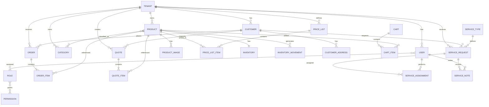

# AXYRA — Domain Model

**Versión:** 1.0
**Estado:** Draft / Baseline
**Fecha:** 2026-10-06
**Proyecto:** AXYRA
**Documento:** Domain Model

---

# 1. Propósito

Este documento define el modelo de dominio de AXYRA, identificando las principales entidades del negocio, sus responsabilidades, relaciones, reglas e invariantes.

El modelo de dominio constituye la representación lógica del negocio sobre la cual posteriormente se definirán:

* Arquitectura del sistema.
* Modelo de datos.
* API.
* Servicios backend.
* Interfaces de usuario.
* Reglas de negocio.
* Seguridad y autorización.
* Pruebas automatizadas.

El dominio debe permanecer independiente de una tecnología específica. La selección de PostgreSQL, Supabase, React, Vercel u otras tecnologías pertenece a fases posteriores del diseño.

---

# 2. Alcance del dominio

AXYRA es una plataforma SaaS multi-tenant orientada a empresas que:

* Comercializan productos.
* Comercializan servicios.
* Gestionan inventario.
* Reciben pedidos.
* Gestionan clientes.
* Elaboran cotizaciones.
* Gestionan solicitudes de servicio técnico.
* Analizan su operación comercial.
* Configuran usuarios, permisos y módulos.

El dominio debe permitir que diferentes tipos de empresas utilicen la misma plataforma sin que el modelo dependa exclusivamente de un sector.

Ejemplos:

* Tiendas de materiales eléctricos.
* Ferreterías.
* Distribuidores.
* Tiendas de tecnología.
* Comercios de repuestos.
* Empresas de herramientas.
* Comercios especializados.
* Empresas que combinan productos y servicios.

---

# 3. Principios del modelo de dominio

El diseño del dominio seguirá los siguientes principios:

## 3.1 Multi-tenancy

Cada empresa registrada en AXYRA constituye un `Tenant`.

Los datos operativos pertenecen a un Tenant y no deben ser accesibles desde otro Tenant.

La separación debe garantizarse en backend y persistencia, no únicamente mediante la interfaz.

---

## 3.2 Independencia tecnológica

Las entidades del dominio no deben depender directamente de:

* Frameworks frontend.
* Proveedores de hosting.
* Motores de base de datos.
* APIs externas.
* Proveedores de mensajería.

---

## 3.3 Configurabilidad

Las empresas pueden tener diferentes:

* Catálogos.
* Listas de precios.
* Políticas de inventario.
* Módulos habilitados.
* Horarios.
* Usuarios.
* Servicios.
* Configuraciones comerciales.

---

## 3.4 Trazabilidad

Las operaciones relevantes deben poder reconstruirse históricamente.

Especialmente:

* Cambios de inventario.
* Pedidos.
* Cotizaciones.
* Cambios administrativos.
* Cambios de configuración.
* Acciones de usuarios.

---

## 3.5 Conservación histórica

Los documentos comerciales no deben depender exclusivamente del estado actual de los productos.

Por ejemplo, si un producto cambia de precio posteriormente, un pedido histórico debe conservar el precio con el cual fue creado.

---

# 4. Bounded Contexts

El dominio de AXYRA se organiza conceptualmente en los siguientes contextos:

```text
AXYRA
│
├── Platform
│   ├── Tenant
│   ├── Users
│   ├── Roles
│   └── Permissions
│
├── Catalog
│   ├── Products
│   ├── Categories
│   ├── Images
│   └── Price Lists
│
├── Inventory
│   ├── Inventory
│   └── Inventory Movements
│
├── Customers
│   ├── Customers
│   └── Addresses
│
├── Commerce
│   ├── Cart
│   ├── Orders
│   ├── Quotes
│   └── Order/Quote Items
│
├── Services
│   ├── Service Types
│   ├── Service Requests
│   ├── Assignments
│   └── Notes
│
├── Configuration
│   ├── Tenant Settings
│   ├── Business Hours
│   └── Module Configuration
│
└── Audit
    └── Audit Logs
```

---

# 5. Contexto Platform

## 5.1 Tenant

Representa una empresa o negocio registrado dentro de AXYRA.

### Responsabilidad

Define el límite de aislamiento de los datos de una empresa.

### Atributos principales

* `id`
* `name`
* `legal_name`
* `tax_identifier`
* `slug`
* `status`
* `created_at`
* `updated_at`

### Estados

```text
ACTIVE
SUSPENDED
INACTIVE
```

### Reglas

* Cada Tenant posee un identificador único.
* Los datos operativos deben pertenecer a un Tenant.
* Un Tenant no puede acceder a información perteneciente a otro Tenant.
* El Super Admin de AXYRA no pertenece necesariamente a un Tenant.

---

# 6. Usuarios y autorización

## 6.1 User

Representa una persona que utiliza el panel administrativo de una empresa.

### Atributos principales

* `id`
* `tenant_id`
* `name`
* `email`
* `phone`
* `status`
* `created_at`
* `updated_at`

### Estados

```text
ACTIVE
INACTIVE
SUSPENDED
```

---

## 6.2 Role

Representa un conjunto de responsabilidades dentro del Tenant.

Ejemplos:

* Administrador.
* Vendedor.
* Inventario.
* Técnico.

---

## 6.3 Permission

Representa una acción autorizable dentro de AXYRA.

Ejemplos:

```text
products.read
products.create
products.update
inventory.read
inventory.adjust
orders.read
orders.create
orders.update
quotes.create
services.read
services.manage
users.manage
reports.read
settings.manage
```

---

## 6.4 UserRole

Relaciona usuarios con roles.

Un usuario puede tener uno o varios roles.

---

## 6.5 RolePermission

Relaciona roles con permisos.

Un rol puede tener múltiples permisos y un permiso puede pertenecer a múltiples roles.

---

# 7. Contexto Catalog

## 7.1 Product

Representa un producto comercializable por un Tenant.

### Atributos principales

* `id`
* `tenant_id`
* `name`
* `description`
* `sku`
* `barcode`
* `brand`
* `unit`
* `status`
* `created_at`
* `updated_at`

### Estados

```text
ACTIVE
INACTIVE
ARCHIVED
```

### Reglas

* El SKU debe ser único dentro del Tenant.
* Un producto pertenece a un Tenant.
* Un producto puede aparecer en uno o varios listados de precios.
* El producto no debe almacenar únicamente un precio fijo si el Tenant utiliza múltiples listas de precios.

---

# 8. Category

Representa una categoría utilizada para organizar productos.

### Atributos

* `id`
* `tenant_id`
* `name`
* `description`
* `status`
* `created_at`
* `updated_at`

Una categoría pertenece a un Tenant.

---

# 9. ProductCategory

Relaciona productos con categorías.

Se utiliza una relación muchos-a-muchos para permitir que un producto pueda pertenecer a más de una categoría si el negocio lo requiere.

```text
Product N ─────── N Category
          │
          └── ProductCategory
```

---

# 10. ProductImage

Representa una imagen asociada a un producto.

### Atributos

* `id`
* `product_id`
* `url`
* `alt_text`
* `position`
* `is_primary`

Las imágenes pertenecen indirectamente al Tenant mediante el producto.

---

# 11. PriceList

Representa una lista de precios configurable.

Ejemplos:

```text
Precio público
Precio minorista
Precio mayorista
Precio distribuidor
Precio especial
```

### Atributos

* `id`
* `tenant_id`
* `name`
* `description`
* `currency`
* `is_default`
* `is_public`
* `status`

### Regla

AXYRA no debe asumir que todos los negocios utilizan únicamente precio minorista y mayorista.

Cada Tenant puede crear las listas que necesite.

---

# 12. PriceListItem

Relaciona un producto con una lista de precios.

### Atributos

* `id`
* `price_list_id`
* `product_id`
* `price`
* `minimum_quantity`
* `created_at`
* `updated_at`

```text
Product
   │
   ├── PriceListItem ── PriceList
   ├── PriceListItem ── PriceList
   └── PriceListItem ── PriceList
```

Esto permite que el mismo producto tenga diferentes precios dependiendo del contexto comercial.

---

# 13. Contexto Inventory

## 13.1 Inventory

Representa el estado de inventario de un producto dentro de un Tenant.

### Atributos principales

* `id`
* `tenant_id`
* `product_id`
* `quantity`
* `minimum_quantity`
* `reserved_quantity`
* `updated_at`

### Conceptos

```text
Disponible = quantity - reserved_quantity
```

La implementación definitiva de esta fórmula podrá modificarse durante el diseño técnico.

---

# 14. InventoryMovement

Representa una modificación del inventario.

### Tipos

```text
IN
OUT
ADJUSTMENT_IN
ADJUSTMENT_OUT
RESERVATION
RELEASE
```

### Atributos principales

* `id`
* `tenant_id`
* `product_id`
* `type`
* `quantity`
* `reason`
* `reference_type`
* `reference_id`
* `performed_by`
* `created_at`

### Principio

El inventario debe ser trazable.

No se debe depender únicamente de modificar un número de stock sin registrar el movimiento que produjo el cambio.

Ejemplo:

```text
Entrada +20
    ↓
Stock 20

Salida -5
    ↓
Stock 15

Ajuste +2
    ↓
Stock 17
```

---

# 15. Contexto Customers

## 15.1 Customer

Representa un cliente de un Tenant.

### Atributos

* `id`
* `tenant_id`
* `name`
* `email`
* `phone`
* `document_type`
* `document_number`
* `customer_type`
* `status`
* `created_at`
* `updated_at`

### Customer Type

Puede representar conceptos como:

```text
INDIVIDUAL
BUSINESS
```

La clasificación comercial más avanzada podrá evolucionar posteriormente.

---

# 16. CustomerAddress

Representa una dirección asociada a un cliente.

### Atributos

* `id`
* `customer_id`
* `label`
* `address`
* `city`
* `department`
* `postal_code`
* `is_primary`

Un cliente puede tener múltiples direcciones.

---

# 17. Contexto Commerce

## 17.1 Cart

Representa el carrito de compra.

AXYRA debe permitir carrito para usuarios no autenticados durante el MVP.

### Atributos

* `id`
* `tenant_id`
* `customer_id` opcional
* `session_identifier`
* `status`
* `created_at`
* `updated_at`

### Estados

```text
ACTIVE
CONVERTED
ABANDONED
EXPIRED
```

---

# 18. CartItem

Representa un producto dentro del carrito.

### Atributos

* `id`
* `cart_id`
* `product_id`
* `quantity`
* `unit_price`

El precio utilizado debe quedar determinado durante el proceso comercial correspondiente.

---

# 19. Order

Representa una orden comercial creada por un cliente.

### Atributos principales

* `id`
* `tenant_id`
* `customer_id` opcional
* `order_number`
* `status`
* `price_list_id`
* `subtotal`
* `discount`
* `tax`
* `total`
* `notes`
* `created_at`
* `updated_at`

### Estados iniciales

```text
PENDING
CONFIRMED
PROCESSING
READY
COMPLETED
CANCELLED
```

### Regla importante

Una orden debe conservar el contexto comercial utilizado en el momento de creación.

El cambio posterior del producto no debe modificar automáticamente una orden histórica.

---

# 20. OrderItem

Representa un producto dentro de una orden.

### Atributos

* `id`
* `order_id`
* `product_id`
* `product_name_snapshot`
* `sku_snapshot`
* `quantity`
* `unit_price`
* `discount`
* `tax`
* `subtotal`
* `total`

Los campos `snapshot` permiten conservar información histórica.

---

# 21. Quote

Representa una cotización comercial.

### Atributos

* `id`
* `tenant_id`
* `customer_id` opcional
* `quote_number`
* `status`
* `price_list_id`
* `subtotal`
* `discount`
* `tax`
* `total`
* `valid_until`
* `notes`
* `created_at`
* `updated_at`

### Estados

```text
DRAFT
SENT
VIEWED
ACCEPTED
REJECTED
EXPIRED
CONVERTED
CANCELLED
```

---

# 22. QuoteItem

Representa un producto dentro de una cotización.

Debe conservar información histórica equivalente a `OrderItem`.

---

# 23. Conversión de cotización a orden

Una cotización aceptada puede convertirse en una orden.

```text
Quote
  │
  │ ACCEPTED
  ↓
Order
```

La conversión debe conservar la información comercial relevante.

La implementación exacta de esta conversión se definirá posteriormente.

---

# 24. Contexto Services

## 24.1 ServiceType

Representa un tipo de servicio ofrecido por el Tenant.

Ejemplos:

* Instalación.
* Mantenimiento.
* Reparación.
* Diagnóstico.
* Asesoría técnica.
* Visita técnica.

### Atributos

* `id`
* `tenant_id`
* `name`
* `description`
* `base_price`
* `duration_estimate`
* `status`

---

# 25. ServiceRequest

Representa una solicitud concreta de servicio realizada por un cliente.

### Atributos

* `id`
* `tenant_id`
* `customer_id`
* `service_type_id`
* `status`
* `description`
* `scheduled_at`
* `address`
* `created_at`
* `updated_at`

### Estados

```text
REQUESTED
REVIEWING
SCHEDULED
ASSIGNED
IN_PROGRESS
COMPLETED
CANCELLED
```

---

# 26. ServiceAssignment

Representa la asignación de un técnico o usuario responsable a una solicitud.

### Atributos

* `id`
* `service_request_id`
* `user_id`
* `assigned_at`
* `completed_at`
* `status`

Una solicitud puede tener diferentes responsables a lo largo de su ciclo de vida si el negocio lo requiere.

---

# 27. ServiceNote

Representa una observación o registro realizado durante la atención de un servicio.

### Atributos

* `id`
* `service_request_id`
* `author_id`
* `content`
* `created_at`

Ejemplos:

* Diagnóstico realizado.
* Material utilizado.
* Problema encontrado.
* Trabajo ejecutado.
* Recomendaciones.

---

# 28. Contexto Configuration

## 28.1 TenantSettings

Contiene la configuración general del Tenant.

Puede incluir:

* Nombre comercial.
* Logo.
* Información de contacto.
* Moneda.
* Configuración de pedidos.
* Política de inventario.
* Número de WhatsApp.
* Lista de precios pública.
* Configuración de catálogo.
* Preferencias comerciales.

---

# 29. BusinessHours

Representa los horarios de atención del negocio.

### Atributos

* `id`
* `tenant_id`
* `day_of_week`
* `opening_time`
* `closing_time`
* `is_open`

Puede utilizarse posteriormente para:

* Mostrar horarios.
* Validar solicitudes de servicio.
* Determinar disponibilidad.
* Automatizar respuestas.

---

# 30. ModuleConfiguration

Representa los módulos habilitados para un Tenant.

Ejemplos:

```text
CATALOG
INVENTORY
ORDERS
QUOTES
SERVICES
ANALYTICS
WHATSAPP
```

### Objetivo

Permitir que AXYRA sea modular.

Una empresa podría utilizar:

```text
Catálogo
+ Inventario
+ Pedidos
+ WhatsApp
```

Mientras otra podría utilizar:

```text
Catálogo
+ Inventario
+ Pedidos
+ Cotizaciones
+ Servicios
+ Analítica
```

---

# 31. Contexto Audit

## 31.1 AuditLog

Registra acciones importantes realizadas dentro de AXYRA.

### Atributos

* `id`
* `tenant_id`
* `user_id`
* `action`
* `entity_type`
* `entity_id`
* `previous_value`
* `new_value`
* `ip_address`
* `created_at`

### Ejemplos

```text
PRODUCT_CREATED
PRODUCT_UPDATED
INVENTORY_ADJUSTED
ORDER_CREATED
ORDER_CANCELLED
USER_CREATED
ROLE_UPDATED
SETTINGS_UPDATED
```

Los eventos exactos se definirán durante la implementación.

---

# 32. Integración con WhatsApp

WhatsApp se considera una integración externa y no una entidad central del dominio comercial.

El dominio debe representar la intención de comunicación sin depender directamente de un proveedor específico.

Conceptualmente:

```text
Order
   │
   ↓
Communication Request
   │
   ↓
WhatsApp Adapter
   │
   ↓
WhatsApp
```

Durante el MVP se podrá utilizar un enlace directo hacia WhatsApp.

Posteriormente podrá incorporarse una integración mediante API oficial sin modificar el núcleo comercial de AXYRA.

---

# 33. Pagos

Los pagos no forman parte obligatoria del MVP.

La arquitectura deberá dejar espacio para incorporar posteriormente:

```text
Order
   │
   ↓
Payment
   │
   ├── PENDING
   ├── AUTHORIZED
   ├── PAID
   ├── FAILED
   └── REFUNDED
```

No se introduce `Payment` como entidad obligatoria del dominio MVP hasta definir el proveedor y flujo de pago.

---

# 34. Relación general del dominio

```text
                         ┌──────────────┐
                         │    Tenant    │
                         └──────┬───────┘
                                │
              ┌─────────────────┼──────────────────┐
              │                 │                  │
              ▼                 ▼                  ▼
          Users            Customers          Settings
              │                 │
              │                 │
              │          ┌──────┴──────┐
              │          │             │
              │       Orders        Services
              │          │             │
              │          │             │
              ▼          ▼             ▼
           Roles      OrderItems   ServiceRequests
              │
              ▼
         Permissions


          ┌───────────────────────────────┐
          │            Catalog            │
          │                               │
          │ Products ─ Categories         │
          │    │                          │
          │    ├── PriceListItems         │
          │    │       │                  │
          │    │       └── PriceLists     │
          │    │                          │
          │    └── Inventory              │
          │            │                  │
          │            └── Movements      │
          └───────────────────────────────┘
```

---

# 35. Relaciones principales

| Entidad        | Relación | Entidad           |
| -------------- | -------- | ----------------- |
| Tenant         | 1:N      | User              |
| Tenant         | 1:N      | Customer          |
| Tenant         | 1:N      | Product           |
| Tenant         | 1:N      | Category          |
| Tenant         | 1:N      | PriceList         |
| Tenant         | 1:N      | Order             |
| Tenant         | 1:N      | Quote             |
| Tenant         | 1:N      | ServiceRequest    |
| Tenant         | 1:N      | ServiceType       |
| Tenant         | 1:N      | AuditLog          |
| User           | N:M      | Role              |
| Role           | N:M      | Permission        |
| Product        | N:M      | Category          |
| Product        | N:M      | PriceList         |
| Product        | 1:1      | Inventory         |
| Product        | 1:N      | InventoryMovement |
| Customer       | 1:N      | CustomerAddress   |
| Customer       | 1:N      | Order             |
| Customer       | 1:N      | Quote             |
| Customer       | 1:N      | ServiceRequest    |
| Cart           | 1:N      | CartItem          |
| Order          | 1:N      | OrderItem         |
| Quote          | 1:N      | QuoteItem         |
| ServiceType    | 1:N      | ServiceRequest    |
| ServiceRequest | 1:N      | ServiceAssignment |
| ServiceRequest | 1:N      | ServiceNote       |
| User           | 1:N      | ServiceAssignment |
| User           | 1:N      | ServiceNote       |

---

# 36. Aggregate Roots

Los principales Aggregate Roots conceptuales son:

```text
Tenant
Product
Customer
Cart
Order
Quote
ServiceRequest
PriceList
```

Un Aggregate Root controla la consistencia de las entidades que pertenecen a su agregado.

Por ejemplo:

```text
Order
 ├── OrderItem
 └── Order state
```

Los `OrderItem` no deberían gestionarse independientemente del agregado `Order`.

---

# 37. Reglas de aislamiento multi-tenant

Toda entidad operativa debe cumplir una de las siguientes condiciones:

1. Poseer directamente `tenant_id`.
2. Pertenecer a una entidad que determine inequívocamente su Tenant.

Ejemplo:

```text
Order
 └── OrderItem
      └── Product
```

El acceso a `OrderItem` debe estar condicionado por el Tenant de la orden.

Nunca debe ser posible:

```text
Tenant A
   ↓
Order A
   ↓
Product B
```

si `Product B` pertenece a otro Tenant.

---

# 38. Reglas de inventario

El inventario debe permitir determinar:

```text
Stock físico
Stock reservado
Stock disponible
```

La política de venta ante falta de stock será configurable por Tenant.

Posibles políticas:

```text
BLOCK
QUOTE
ALLOW
```

### BLOCK

No permite generar una orden cuando no existe stock suficiente.

### QUOTE

Permite generar una cotización en lugar de una orden inmediata.

### ALLOW

Permite registrar la operación aunque el stock sea insuficiente, de acuerdo con la configuración del negocio.

---

# 39. Reglas de precios

El precio de un producto depende del contexto comercial.

No se debe asumir:

```text
Product.price
Product.wholesale_price
```

como estructura universal.

El modelo utiliza:

```text
Product
    ↓
PriceListItem
    ↓
PriceList
```

Esto permite soportar diferentes estrategias comerciales sin modificar el modelo central.

---

# 40. Reglas de pedidos

Una orden debe:

* Pertenecer a un Tenant.
* Contener al menos un producto.
* Registrar cantidades positivas.
* Registrar precios utilizados.
* Tener un estado válido.
* Mantener información histórica de sus productos.
* Respetar la política de inventario configurada.
* Poder convertirse posteriormente en una operación pagada cuando se implemente el módulo de pagos.

---

# 41. Reglas de cotizaciones

Una cotización debe:

* Pertenecer a un Tenant.
* Contener al menos un elemento comercial.
* Tener fecha de creación.
* Tener estado.
* Poder establecer una fecha de vencimiento.
* Conservar los precios utilizados.
* Poder convertirse en una orden cuando sea aceptada.

---

# 42. Reglas de servicios

Una solicitud de servicio debe:

* Pertenecer a un Tenant.
* Tener un tipo de servicio.
* Identificar al cliente cuando sea necesario.
* Poseer una descripción.
* Tener un estado válido.
* Poder ser asignada a uno o varios responsables.
* Mantener notas y trazabilidad durante su ciclo de vida.

---

# 43. Estados y máquinas de estado

Las entidades con estados deben implementar transiciones controladas.

Ejemplo:

```text
Order

PENDING
   │
   ▼
CONFIRMED
   │
   ▼
PROCESSING
   │
   ▼
READY
   │
   ▼
COMPLETED
```

Una cancelación puede producirse únicamente en estados permitidos.

No todas las transiciones serán válidas.

Ejemplo:

```text
COMPLETED → PENDING
```

no debería permitirse como transición normal.

Las reglas definitivas de transición se especificarán en la arquitectura y lógica de aplicación.

---

# 44. Datos derivados

Algunos valores pueden derivarse de otros datos.

Ejemplo:

```text
Order.total
=
subtotal
- discount
+ tax
```

Inventario:

```text
available_quantity
=
quantity
- reserved_quantity
```

Los mecanismos para calcular, almacenar o cachear estos valores serán definidos durante el diseño técnico.

---

# 45. Eliminación y conservación de datos

Las entidades comerciales históricas no deben eliminarse físicamente de forma indiscriminada.

Especialmente:

* Orders.
* Quotes.
* InventoryMovements.
* AuditLogs.

Cuando sea necesario, se preferirá:

```text
ACTIVE
INACTIVE
ARCHIVED
CANCELLED
```

sobre eliminación física.

La política exacta de `soft delete` será definida en la arquitectura de persistencia.

---

# 46. Eventos de dominio potenciales

El modelo permite identificar eventos futuros como:

```text
TenantCreated
UserCreated
ProductCreated
ProductUpdated
InventoryIncreased
InventoryDecreased
OrderCreated
OrderConfirmed
OrderCompleted
OrderCancelled
QuoteCreated
QuoteAccepted
QuoteConverted
ServiceRequested
ServiceScheduled
ServiceCompleted
```

Estos eventos podrán utilizarse posteriormente para:

* Notificaciones.
* Automatizaciones.
* Integraciones.
* Analítica.
* WhatsApp.
* n8n.
* Auditoría.
* Sistemas externos.

No todos estos eventos deben implementarse durante el MVP.

---

# 47. Diagrama conceptual



---

# 48. MVP vs evolución

## MVP

El dominio MVP contempla:

* Tenant.
* Users.
* Roles.
* Permissions.
* Products.
* Categories.
* Product images.
* Price lists.
* Inventory.
* Inventory movements.
* Customers.
* Customer addresses.
* Cart.
* Orders.
* Order items.
* Quotes.
* Quote items.
* Service types.
* Service requests.
* Service assignments.
* Service notes.
* Tenant settings.
* Business hours.
* Module configuration.
* Audit logs.
* Integración inicial con WhatsApp mediante enlace.

---

## Evolución posterior

Podrán incorporarse:

* Product variants.
* Multiple warehouses.
* Multiple branches.
* Suppliers.
* Purchase orders.
* Accounts receivable.
* Payments.
* Invoices.
* Taxes avanzados.
* Promotions.
* Coupons.
* Loyalty.
* Shipping.
* Delivery tracking.
* WhatsApp Business API.
* Automatizaciones.
* AI Agents.
* Advanced analytics.
* External integrations.
* Marketplace capabilities.

Estas capacidades no deben introducir complejidad innecesaria en el MVP.

---

# 49. Decisiones pendientes

Las siguientes decisiones deberán resolverse antes del diseño definitivo de persistencia:

1. Estrategia exacta para multi-tenancy en PostgreSQL.
2. Uso de Row Level Security.
3. Estrategia de generación de identificadores.
4. Estrategia de numeración de pedidos y cotizaciones.
5. Manejo definitivo de impuestos.
6. Manejo de moneda.
7. Estrategia de stock reservado.
8. Soporte de múltiples almacenes.
9. Soporte de variantes de producto.
10. Estrategia de almacenamiento de imágenes.
11. Política definitiva de eliminación lógica.
12. Estrategia de auditoría.
13. Estrategia de eventos de dominio.
14. Integración futura con WhatsApp Business API.
15. Modelo de pagos.
16. Modelo de facturación.
17. Estrategia de analítica.

Estas decisiones no bloquean el presente modelo conceptual.

---

# 50. Resultado del modelo

El dominio de AXYRA establece una separación clara entre:

```text
PLATFORM
   ↓
TENANTS
   ↓
BUSINESS OPERATIONS
   ├── Catalog
   ├── Inventory
   ├── Customers
   ├── Commerce
   ├── Services
   └── Configuration
```

El modelo está diseñado para que AXYRA pueda comenzar con un negocio concreto —por ejemplo, un distribuidor de materiales eléctricos— sin quedar acoplado a ese sector.

La primera implementación utilizará el mismo núcleo de dominio para diferentes tipos de empresas.

---

# 51. Próximo documento

Una vez aprobado este Domain Model, el siguiente artefacto será:

```text
docs/03-Domain/AXYRA_Conceptual_ERD_v1.0.md
```

Este documento transformará el dominio anterior en un modelo entidad-relación conceptual.

Después se continuará con:

```text
Domain Model
      ↓
Conceptual ERD
      ↓
Architecture Specification
      ↓
Architecture Decision Records
      ↓
Database Design
      ↓
API Design
      ↓
UX / UI Architecture
      ↓
Implementation
```

La implementación de código no debe comenzar hasta establecer estas bases.

---

# 52. Invariantes de dominio por agregado

Los agregados del sistema deben mantener consistencia interna antes de aceptar cambios. Las siguientes reglas son esenciales para evitar errores funcionales y de seguridad.

## 52.1 Tenant

- Un Tenant debe tener un identificador único y un nombre comercial.
- El Tenant es la unidad de aislamiento de todos los datos de negocio.
- Un usuario, producto, pedido o servicio solo puede pertenecer a un Tenant.
- Un Tenant activo no puede ser eliminado físicamente si existen datos operativos asociados.

## 52.2 Product

- El SKU debe ser único dentro del Tenant.
- Un producto debe estar asociado a una categoría o a una colección vacía explícitamente definida.
- El estado del producto debe ser válido: `ACTIVE`, `INACTIVE` o `ARCHIVED`.
- El producto no puede depender de un único precio si la empresa usa múltiples listas de precios.

## 52.3 Inventory

- `quantity` debe representar la cantidad total del producto.
- `reserved_quantity` no puede exceder `quantity`.
- `available_quantity` debe ser calculado como diferencia entre cantidad total y cantidad reservada.
- Cada cambio físico debe registrarse como un `InventoryMovement` con motivo y responsable.

## 52.4 Cart

- Un carrito debe contener al menos un ítem válido antes de convertirse en pedido.
- La cantidad de cada item debe ser mayor que cero.
- El carrito no debe permitir un producto duplicado en la misma sesión salvo que se consolide como líneas separadas con distinta lógica comercial.
- El carrito debe respetar el estado del inventario vigente en el momento de la validación.

## 52.5 Order

- Una orden debe tener al menos un `OrderItem` válido.
- El total debe ser derivado de subtotales, descuentos e impuestos.
- El precio del item debe mantenerse inmutable una vez creada la orden.
- El estado del pedido debe ser coherente con la operación comercial.

## 52.6 Quote

- Una cotización debe conservar los precios y cantidades asociados al momento de la solicitud.
- Una cotización no puede convertirse en orden si no está en estado aceptado.
- La fecha de vencimiento, si existe, debe ser posterior a la fecha de creación.

## 52.7 ServiceRequest

- Una solicitud de servicio debe tener un Tenant asociado y un tipo de servicio válido.
- El estado de la solicitud debe reflejar el ciclo de atención real.
- Si el servicio está finalizado o cancelado, no debe permitirse nueva asignación activa.
- Las notas del servicio deben mantener autor y fecha de creación.

## 52.8 AuditLog

- Los registros de auditoría no deben ser modificados por usuarios normales.
- El log debe registrar el usuario, la entidad afectada, el cambio y el contexto del tenant.
- La auditoría es una fuente de verdad para trazabilidad y análisis forense.

---

# 53. Ciclos de vida y transiciones clave

El dominio de AXYRA requiere control explícito de estados para evitar inconsistencias operativas.

## 53.1 Cart

```text
ACTIVE
  ├── CONVERTED
  ├── ABANDONED
  └── EXPIRED
```

Reglas:
- Un carrito `ACTIVE` puede convertirse a `CONVERTED` solo si se genera un pedido válido.
- Si pasa una fecha de vencimiento, debe marcarse como `EXPIRED`.
- Un carrito sin uso por tiempo prolongado puede ser abandonado.

## 53.2 Order

```text
PENDING
  └── CONFIRMED
        └── PROCESSING
              └── READY
                    └── COMPLETED

PENDING/CONFIRMED/PROCESSING → CANCELLED
```

Reglas:
- `COMPLETED` no debe volver a `PENDING`.
- `CANCELLED` debe ser una transición final o terminal.
- Las transiciones deben registrarse en auditoría.

## 53.3 Quote

```text
DRAFT
  └── SENT
        ├── VIEWED
        ├── ACCEPTED
        ├── REJECTED
        └── EXPIRED
```

Reglas:
- `ACCEPTED` puede disparar la creación de una orden relacionada.
- `CONVERTED` debe ser un estado posterior a la aceptación y no debe permitirse si la cotización ya fue rechazada o vencida.

## 53.4 ServiceRequest

```text
REQUESTED
  └── REVIEWING
        ├── SCHEDULED
        ├── ASSIGNED
        └── IN_PROGRESS
                ├── COMPLETED
                └── CANCELLED
```

Reglas:
- `ASSIGNED` y `IN_PROGRESS` requieren una persona responsable.
- `COMPLETED` debe consolidar el registro de observaciones y cierre de la solicitud.

## 53.5 InventoryMovement

Los movimientos no deben ser estados transaccionales de negocio, sino eventos de modificación del stock. Su estructura debe permitir reconstrucción histórica.

Ejemplos:
- `IN`: entrada por compra o devolución.
- `OUT`: salida por venta o consumo.
- `ADJUSTMENT_IN`: ajuste positivo manual.
- `ADJUSTMENT_OUT`: ajuste negativo manual.
- `RESERVATION`: reserva temporal.
- `RELEASE`: liberación de reserva.

---

# 54. Reglas de negocio expresadas como políticas

El modelo de dominio debe permitir políticas configurables por Tenant. Las siguientes políticas son clave para el MVP y para la evolución futura.

## 54.1 Política de precios

Cada Tenant debe definir:
- si usa listas de precios.
- si utiliza precio minorista, mayorista o ambos.
- si las listas son públicas o internas.
- si un cliente puede elegir una lista o si la selección es automática.

## 54.2 Política de inventario

Cada Tenant debe determinar:
- si el sistema bloquea la compra cuando no hay suficiente stock.
- si permite cotización en lugar de venta inmediata.
- si permite vender con stock insuficiente bajo condiciones específicas.

## 54.3 Política de clientes

- El cliente puede ser identificado con o sin cuenta.
- El negocio puede exigir datos adicionales según su flujo comercial.
- Los clientes deben conservar historial de pedidos y servicios.

## 54.4 Política de seguridad

- Ningún usuario debe poder acceder a recursos de otro Tenant.
- Los permisos deben evaluarse en backend, nunca solo en frontend.
- El Owner y el Admin tienen un alcance distinto del Super Admin corporativo.

## 54.5 Política de módulos

Un Tenant puede activar o desactivar módulos según su operación.

Ejemplo:
- Módulo de inventario habilitado.
- Módulo de servicios deshabilitado.
- Módulo de cotizaciones habilitado.
- Módulo de analítica no activado.

## 54.6 Política de conservación histórica

Aquellos registros comerciales “históricos” no deben borrarse físicamente si su desaparición compromete trazabilidad e integridad.

Se recomienda:
- `CANCELLED` para pedidos y cotizaciones.
- `ARCHIVED` para productos y categorías.
- `INACTIVE` para usuarios y servicios.
- `LOG_ONLY` o `IMMUTABLE` para movimientos y auditoría.

---

# 55. Matriz de trazabilidad del dominio

| Dominio | Requisito principal | Agregado central | Artefacto descendente |
| --- | --- | --- | --- |
| Multi-tenancy | FR-TEN-001 a FR-TEN-004 | Tenant | Base de datos, políticas, autorización |
| Catálogo | FR-CAT-001 a FR-CAT-009 | Product, PriceList | API de catálogo, gestión de precios |
| Inventario | FR-INV-001 a FR-INV-008 | Inventory, InventoryMovement | Stock, movimientos, alertas |
| Clientes | FR-CUS-001 a FR-CUS-004 | Customer | Perfil, historial, direcciones |
| Carrito y pedidos | FR-CART-001 a FR-ORD-006 | Cart, Order | Checkout, validación, WhatsApp |
| Cotizaciones | FR-QUO-001 a FR-QUO-003 | Quote | Flujo de aprobación y conversión |
| Servicios | FR-SRV-001 a FR-SRV-005 | ServiceRequest | Solicitud, asignación, observaciones |
| Seguridad | FR-SEC-001 a FR-SEC-003 | User, Role, Permission | RBAC, middleware de permisos |
| Dashboard | FR-DAS-001 a FR-DAS-004 | DashboardMetric | Analítica y reportes |
| Auditoría | FR-AUD-001 a FR-AUD-002 | AuditLog | Log, eventos, trazabilidad |

Esta matriz permite rastrear que cada concepto del modelo de dominio está conectado con requisitos de negocio y con diseño técnico posterior.

---

# 56. Criterios de calidad del dominio

El modelo de dominio será considerado robusto si cumple las siguientes condiciones:

- El dominio refleja claramente la lógica del negocio y no la tecnología.
- Cada entidad tiene un propósito y responsabilidades coherentes.
- Los agregados protegen la consistencia del negocio.
- El multi-tenancy está presente en la raíz del diseño.
- Los eventos y cambios relevantes pueden ser auditados.
- El modelo permite evolución sin reescribir el núcleo del negocio.
- Las entidades históricas conservan la información necesaria para análisis comercial.

---

# 57. Conclusión del modelo

AXYRA define un dominio modular, multi-tenant y orientado a operaciones comerciales reales. El modelo no está limitado a una sola industria ni a un solo tipo de venta; su fuerza radica en que la capa de negocio está diseñada para soportar catálogo, inventario, clientes, pedidos, servicios y análisis bajo una estructura común y extensible.

La calidad del diseño posterior dependerá de mantener esta separación clara entre:

```text
Dominio del negocio
      ↓
Reglas y políticas
      ↓
Persistencia
      ↓
Arquitectura
      ↓
Implementación
```

Este modelo establece la base para que el siguiente artefacto —el ERD conceptual— traduzca estas entidades en una estructura más formal y ejecutable sin perder claridad de negocio.

---

# 58. Siguiente artefacto

El documento que continúa esta línea es:

```text
docs/03-Domain/AXYRA_Conceptual_ERD_v1.0.md
```

Allí se convertirá el modelo conceptual en un esquema de entidades, relaciones y dependencias que será la base para la base de datos y la capa de servicios.
